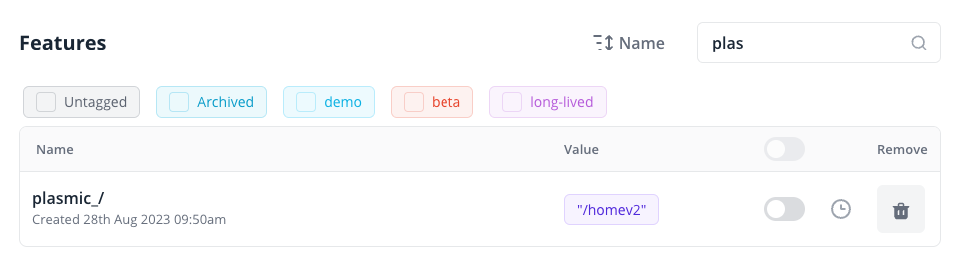
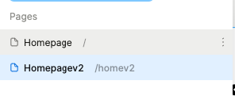

# Flagsmith with Plasmic

## How it works

Here we combine Flagsmith Feature flags with Plasmic pages.

When Plasmic compiles pages we check whether we have a remote config for that url, if we do we render that page instead.

Based on the following, we render /homev2 when visiting /:




## Getting Started

First, run the development server:

```bash
npm run dev
```

Open your browser to see the result.

You can start editing your project in Plasmic Studio. The page auto-updates as you edit the project.

## Learn More

With Plasmic, you can enable non-developers on your team to publish pages and content into your website or app.

To learn more about Plasmic, take a look at the following resources:

- [Plasmic Website](https://www.plasmic.app/)
- [Plasmic Documentation](https://docs.plasmic.app/learn/)
- [Plasmic Slack Community](https://www.plasmic.app/slack)

You can check out [the Plasmic GitHub repository](https://github.com/plasmicapp/plasmic) - your feedback and contributions are welcome!
